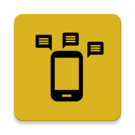
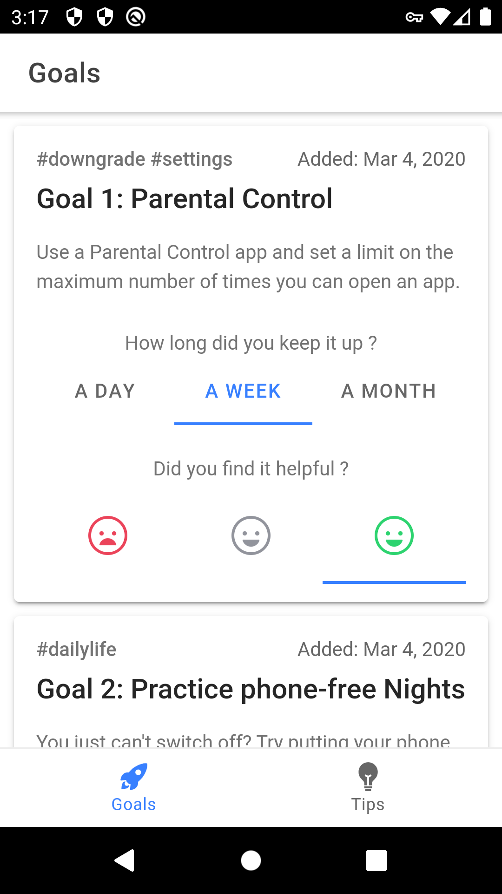
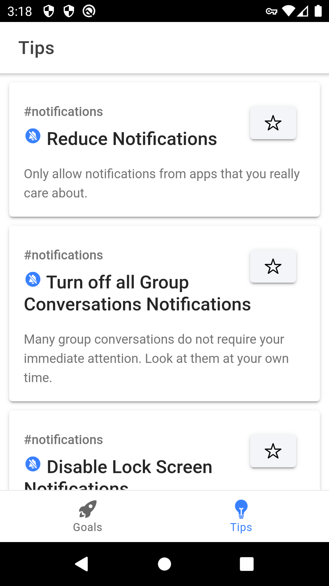
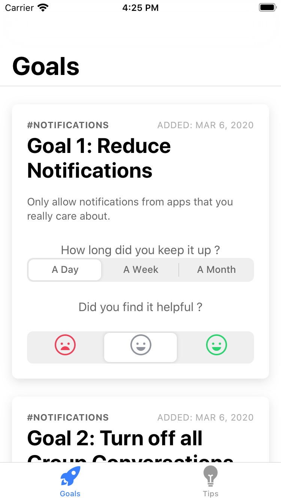
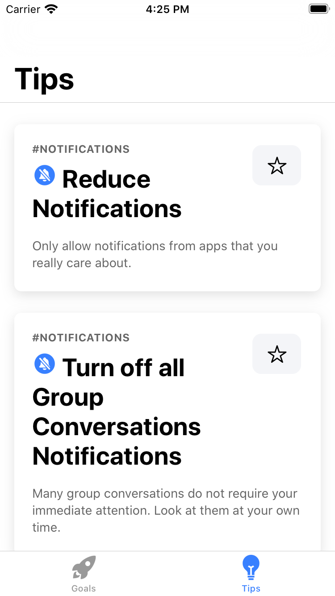

# Digital Habits

Digital Habits aims to help you develop healthy digital habits. It comes with tips to reduce digital distraction, and a feature to keep track of your habit goals.

<p align="center">
  
</p>

Developed by [Guillaume Couairon](https://github.com/PhazCode) and [Konrad Kollnig](https://github.com/kasnder).

## Installation

Android: Download [here](https://play.google.com/store/apps/details?id=build.digital.habits) from the Google Play Store.

<p align="center">
    
    
</p>

iOS: Download [here](https://apps.apple.com/app/digital-habits/id1502029615) from the Apple App Store.

<p align="center">
    
    
</p>


## Build

This app was developed with Ionic v5.

### Development

Use `ionic serve` and debug in web browser.

### Deployment

To build for [Android | iOS]:

```bash
ionic build --prod
npx cap copy [android | ios]
npx cap open [android | ios]
```

Before the first iOS build, you may have to run `sudo xcode-select -s /Applications/Xcode.app/Contents/Developer`.

## Privacy Notice

This app does not collect any data from users.

## Credits

This app uses Material icons from Google.

## License

This project is licensed under [MIT](https://opensource.org/licenses/MIT).
