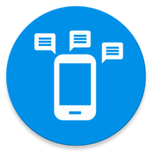

# Digital Habits

Digital Habits aims to help you develop healthy digital habits. It comes with tips to reduce digital distraction, and a feature to keep track of your habit goals.

<p align="center">
  
</p>

Developed by [Guillaume Couairon](https://github.com/PhazCode) and [Konrad Kollnig](https://github.com/kasnder).

## Installation

Android: Download [here](https://play.google.com/store/apps/details?id=build.digital.habits) on the Google Play Store.

iOS: To be released soon.

<p align="center">
    
    
</p>

## Build

This app was developed with Ionic v5.

### Development

Use `ionic serve` and debug in web browser.

### Deployment

To build for Android:

```bash
ionic build --prod
npx cap copy android
npx cap open android
```

## Credits

This app uses Material icons from Google.

## License

This project is licensed under [MIT](https://opensource.org/licenses/MIT).